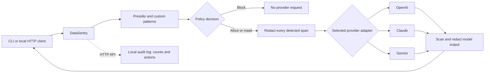

# DataSentry

DataSentry is an open source PII guardrail for text sent to an AI API. It finds personal information locally, applies a policy, and can rewrite sanitized text with OpenAI, Anthropic Claude, or Google Gemini. The rewrite flow **redacts every detected PII span** before the API call. If nothing is detected, the text is sent unchanged. A request containing high-risk PII such as an SSN is blocked before the API call.

DataSentry uses provider APIs, not the ChatGPT, Claude, or Gemini chat websites. Rewriting requires an API key for the provider you select. Detection, masking, and policy checks work without one.

## Try it in five minutes

Requires Python 3.10+ and an API key from one supported provider. From a clone of this repository:

```bash
python3 -m venv .venv
source .venv/bin/activate              # Windows: .venv\Scripts\activate
pip install -r requirements.txt
python -m spacy download en_core_web_sm
cp .env.example .env
```

Open `.env`, set `LLM_PROVIDER` to `openai`, `anthropic`, or `gemini`, paste the matching API key, and change `ADMIN_API_KEY` to a private value. Then:

```bash
python -m datasentry.cli providers
python -m datasentry.cli rewrite \
  "Please make this clearer: Contact Jane at jane@example.com tomorrow." \
  --tone professional --show-sanitized
```

`--show-sanitized` prints exactly what DataSentry sends to the selected provider. With the default provider, the expected shape is:

```text
[INPUT: sanitized text sent to openai]
Please make this clearer: Contact [REDACTED_PERSON] at [REDACTED_EMAIL] [REDACTED_DATE_TIME].

[OUTPUT: rewritten text]
Please contact [REDACTED_PERSON] at [REDACTED_EMAIL] on [REDACTED_DATE_TIME].
```

The wording and detected entity types can vary with model and detector versions. The labels appear with `--show-sanitized`; without it, the CLI prints only the rewritten text for piping. The OpenAI adapter sends `store: false` to the Responses API. The model never receives the removed value; it cannot rewrite facts that were redacted.

Switch providers per request without changing the default:

```bash
python -m datasentry.cli rewrite "Contact jane@example.com" --provider anthropic --show-sanitized
python -m datasentry.cli rewrite "Contact jane@example.com" --provider gemini --show-sanitized
```

Each command needs its provider's key in `.env`. `providers` reports which adapters have a key set without printing keys; it does not check model access. The model can be changed with `OPENAI_MODEL`, `ANTHROPIC_MODEL`, or `GEMINI_MODEL`. OpenAI's `gpt-5-mini` may require [organization verification](https://help.openai.com/en/articles/10910291-api-organization-verification); the tested quick-start default is `gpt-4o-mini`.

### Run the HTTP API

```bash
python -m datasentry.cli serve --host 127.0.0.1 --port 8000
```

Open <http://127.0.0.1:8000/docs> to explore the API. A rewrite request uses the local API key from `.env`:

```bash
curl http://127.0.0.1:8000/api/v1/rewrite \
  -H 'Content-Type: application/json' \
  -H 'X-API-Key: YOUR_ADMIN_API_KEY' \
  -d '{"text":"Please make this clearer: Contact Jane at jane@example.com tomorrow.","tone":"professional","provider":"gemini"}'
```

The response contains `rewritten_text`, `sent_to_provider`, `detected_entity_types`, `provider`, and `model`. It does not echo the original text. Omit `provider` to use `LLM_PROVIDER`. Replace `YOUR_ADMIN_API_KEY` with the value you set in `.env`. The endpoint returns 422 for blocked PII or invalid options, 503 for a missing provider key, and 502 for an upstream error.

### Docker

After copying and editing `.env`, run:

```bash
docker compose up --build
```

The API is bound to `127.0.0.1:8000` on your computer. Docker is optional; it is not needed for the Python quick start. Redis, Elasticsearch, and a database are not required for the core flow.

## How it works



1. [The detector](datasentry/detection/detector.py) combines Presidio's recognizers with [custom regex patterns](datasentry/detection/patterns.py), then removes overlapping matches.
2. [The policy engine](datasentry/policies/engine.py) uses [config/policies.yaml](config/policies.yaml). The rewrite path always blocks when the policy says `block` and redacts **all** detected spans before any provider call, even if a general masking policy would use partial masking.
3. [The rewrite service](datasentry/rewrite.py) resolves an adapter from [the provider registry](datasentry/providers/__init__.py) and passes it sanitized text. Each built-in adapter calls its fixed API endpoint and parses its response. The service scans model output before returning it.
4. [The API](datasentry/api/routes.py) exposes `/rewrite` and the existing detection, masking, sanitization, health, and policy endpoints. The CLI uses the same rewrite service without requiring a server.

The older generic `/proxy` endpoint now returns HTTP 410 because it could forward arbitrary requests without reliably redacting nested content. Use `/rewrite` for this workflow.

## Detection without an API key

```bash
python -m datasentry.cli detect "My email is jane@example.com"
python -m datasentry.cli sanitize "My SSN is 123-45-6789"
```

You can also call `POST /api/v1/detect`, `/mask`, and `/sanitize`. These diagnostic endpoints return the original input and detected values to the **local caller**, so protect access if you deploy the API beyond localhost.

## Configuration

| Setting | Purpose |
| --- | --- |
| `LLM_PROVIDER` | Default rewrite adapter: `openai`, `anthropic`, or `gemini`. |
| `OPENAI_API_KEY`, `ANTHROPIC_API_KEY`, `GEMINI_API_KEY` | Set the key for each provider you use; keys stay on the server or CLI host. |
| `OPENAI_MODEL`, `ANTHROPIC_MODEL`, `GEMINI_MODEL` | Model for each adapter; defaults are in `.env.example`. |
| `ADMIN_API_KEY` | Required in `X-API-Key` for `/rewrite`, `/proxy`, and `/policies`. |
| `POLICY_CONFIG_PATH` | YAML policy file; default `./config/policies.yaml`. |
| `ELASTICSEARCH_URL` | Optional audit destination; unset by default. |

`.env` and runtime logs are ignored by Git. Do not put real PII or API keys in issues, examples, tests, or screenshots. DataSentry is a best-effort detector: false negatives are possible, and a missed value could reach the selected provider. Review detection behavior and policies for your own data before relying on it for sensitive workloads. The demo does not restore redacted values into the answer.

## Plugin structure

The layout follows the same separation used by `career-ops`: one [portable agent skill](.agents/skills/datasentry/SKILL.md) guides the workflow; [provider modules](datasentry/providers) handle external APIs; local keys live in `.env`. See [architecture](docs/ARCHITECTURE.md) and [adding a provider](docs/ADDING_A_PROVIDER.md) for the adapter contract and third-party entry points. A provider plugin runs as Python code in the DataSentry process, so install only plugins you trust.

## Development and contributions

```bash
pip install -r requirements-dev.txt
pytest
```

See [CONTRIBUTING.md](CONTRIBUTING.md) for contribution guidance. The code is licensed under [MIT](LICENSE). The fuller experimental dependency list is kept in [requirements-full.txt](requirements-full.txt); the default requirements install only what the core API and CLI need.

## Provider API references

The built-in adapters follow the official [OpenAI Responses API](https://developers.openai.com/api/docs/guides/text), [Anthropic Messages API](https://platform.claude.com/docs/en/api/messages/create), and [Gemini generateContent API](https://ai.google.dev/api/generate-content). Model availability depends on your provider account; change the model in `.env` if needed.
