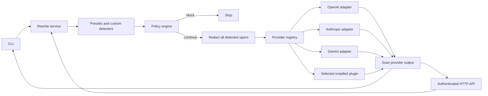

# Architecture

DataSentry separates the local privacy boundary from external model adapters.

The adapter contract is `id`, `model`, `configured`, and `async generate(text, instructions) -> str`. An adapter receives only text that passed local policy and redaction. It never receives the original request or the detection result. The rewrite service also scans returned text for PII before returning it. The CLI and API use the same service.

Built-in adapters are in `datasentry/providers/`. The registry looks up an explicit provider name and imports only a selected third-party entry point. The provider defaults to `LLM_PROVIDER`; callers may override it with `--provider` or the API's `provider` field. An unknown or ambiguous name fails without a network call.

`.env` is local configuration and is ignored by Git. `config/policies.yaml` is the versioned policy template; `POLICY_CONFIG_PATH` can point to a separate local policy file. The agent skill in `.agents/skills/datasentry/` is guidance for agent CLIs and has no access to provider keys by itself. Provider adapters are executable Python code; install third-party adapters only from sources you trust.

DataSentry is a best-effort PII detector. If detection misses a value, that value can reach the selected provider. The former generic proxy remains retired because its arbitrary payload shape could bypass this boundary.
